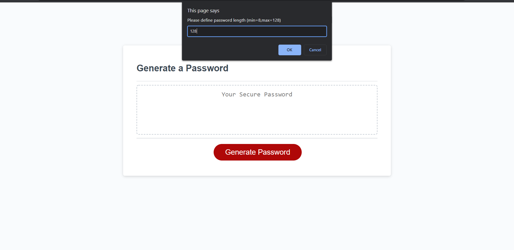
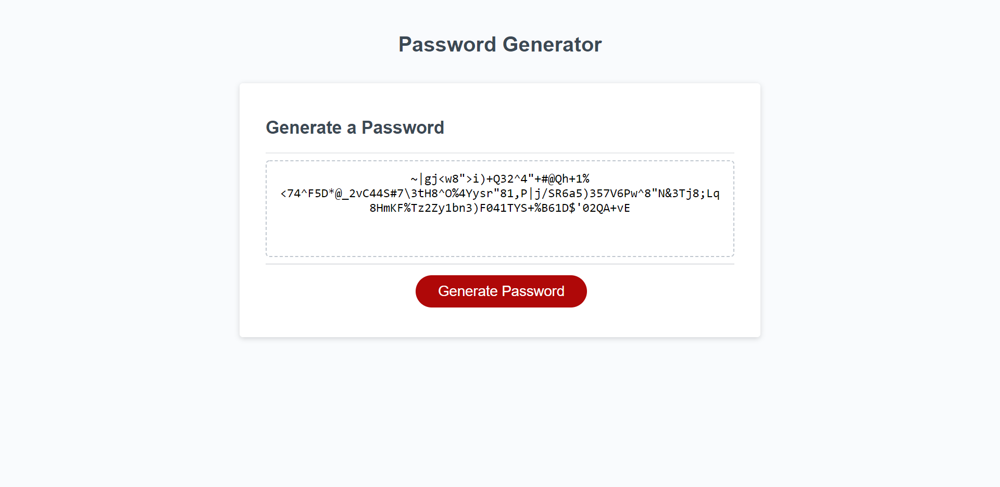
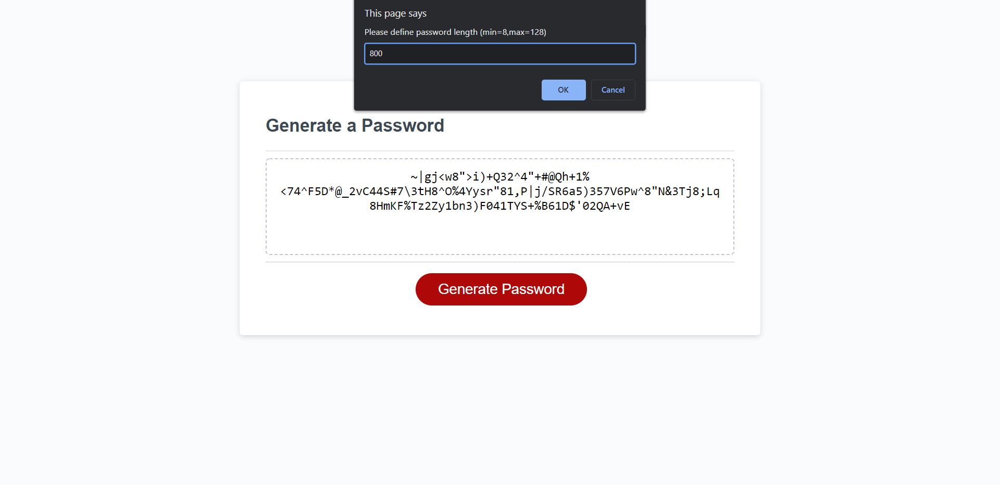
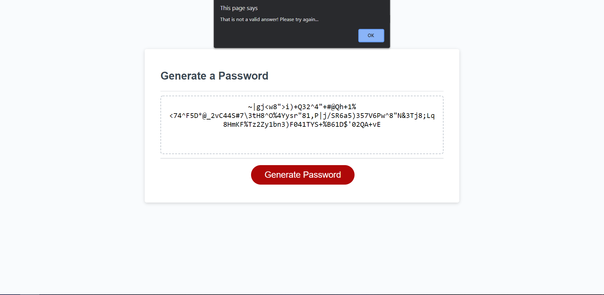

# Password Generator Starter Code
## Password Generator Requirements
Update existing code to make the generate password button do the following:

 ### Ask user for password criteria:
        - [✔️] Ask user to specify password length
        - [✔️] Password must be minimum 8 characters  and a maximum of 128
        - [✔️] Use lowercase characters
        - [✔️] User uppercase characters
        - [✔️] Use numeric characters
        - [✔️] Use special characters
        - [✔️] Password generator must be accessible via a url 
        - [✔️] Link to code must be provided

   ### Checks
        - []Upon incorrect entry program will re-request response until criteria is accepted

Please see link below for Password Generator accesible URL: 
        https://darkjuanjo.github.io/random_password_generator/
        
**Below is the source code for the password generator in github. Please note that code inassets/js. **
        https://github.com/darkjuanjo/random_password_generator

## See below for some screenshots

### Sample Prompt

### Sample Password Generated

### Sample Wrong Entry

### Sample Wrong Prompt Reponse

